# New Relic Trace Test

This example creates a root span with `n` number of child spans. Child spans are created 1 min apart. When the length of the root span exceeds 60 min it is not visible in New Relic

Here is a visual representation of the issue. Note that the `m` number of child spans are being created in the `...` section.

```mermaid
gantt
    title      New Relic Trace Behavior
    dateFormat HH:mm
    axisFormat %H:%M

    section Working
    Root        : 00:00, 55min
    C1          : 00:00, 1min
    C2          : 00:01, 1min
    "..."       : 00:02, 52min
    Cn          : 00:54, 1min

    section Not Working
    Root        : 00:00, 65min
    C1          : 00:00, 1min
    C2          : 00:01, 1min
    "..."       : 00:02, 62min
    Cn          : 01:04,  1min
```

