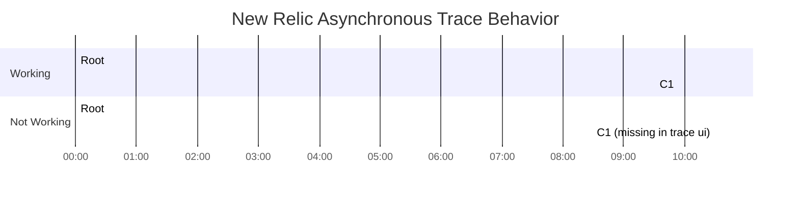

# New Relic Trace Test

## Synchronous

This example creates a root span with `n` number of child spans. Child spans are created 1 min apart. When the length of the root span exceeds 60 min it is not visible in New Relic

Here is a visual representation of the issue. Note that the `m` number of child spans are being created in the `...` section.

```mermaid
gantt
    title      New Relic Synchronous Trace Behavior
    dateFormat HH:mm
    axisFormat %H:%M

    section Working
    Root (missing) : 00:00, 55min
    C1             : 00:00, 1min
    C2             : 00:01, 1min
    "..."          : 00:02, 52min
    Cn             : 00:54, 1min

    section Not Working
    Root (missing) :crit, 00:00, 65min
    C1             :      00:00, 1min
    C2             :      00:01, 1min
    "..."          :      00:02, 62min
    Cn             :      01:04, 1min
```

## Asynchronous

This example creates 2 spans with a short duration. Between each span the program sleeps. When the duration between spans is greater than or equal to 10 minutes both spans are visible in NRDB but not in the tracing UI.

Here is a visual representation of the issue.

